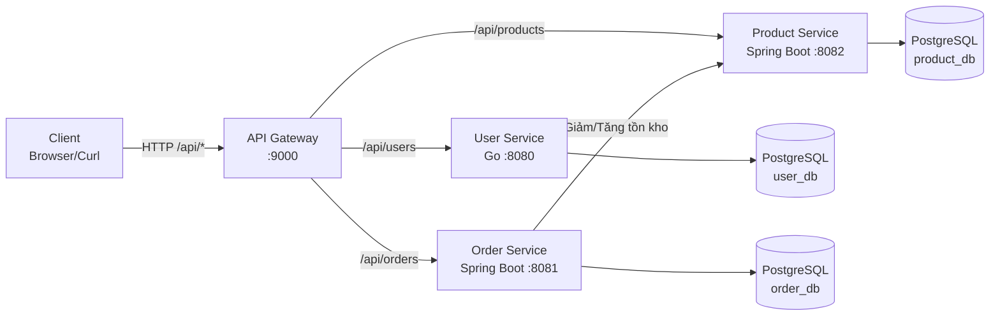

# Mini Ecommerce Microservices

## 1. Tổng quan

**Mini Ecommerce Microservices** là dự án học tập theo hướng microservices + DevOps.
Hệ thống tách service độc lập theo đúng nguyên tắc:

- Mỗi service có codebase và database riêng.
- Giao tiếp giữa các service qua HTTP/REST.
- Client chỉ đi qua một điểm vào là API Gateway.

Thành phần chính:

- `user-service` (Go)
- `product-service` (Spring Boot)
- `order-service` (Spring Boot)
- `api-gateway` (Spring Cloud Gateway)
- `front-end` (React)

Cổng mặc định:

- API Gateway: `9000`
- User Service: `8080`
- Product Service: `8082`
- Order Service: `8081`
- Front-end: `5173`

## 2. Mermaid kiến trúc ứng dụng



## 3. Bảng API cho từng service

Base URL qua Gateway: `http://localhost:9000`

### 3.1 User Service (`/api/users`)

| Method | Endpoint | Auth | Mô tả |
|---|---|---|---|
| GET | `/api/users/health` | Public | Health check |
| POST | `/api/users` | Public | Đăng ký user mới (`CUSTOMER/SELLER/ADMIN`) |
| POST | `/api/users/login` | Public | Đăng nhập, trả JWT |
| GET | `/api/users` | Bearer JWT | Danh sách user active |
| GET | `/api/users/{id}` | Bearer JWT | Lấy user theo ID |
| GET | `/api/users/by-email?email=...` | Bearer JWT | Lấy user theo email |
| GET | `/api/users/email-exists?email=...` | Bearer JWT | Kiểm tra email tồn tại |
| PUT | `/api/users/{id}` | Bearer JWT | Cập nhật user |
| PATCH | `/api/users/{id}/activate` | Bearer JWT | Kích hoạt user |
| PATCH | `/api/users/{id}/deactivate` | Bearer JWT | Vô hiệu hóa user |
| DELETE | `/api/users/{id}` | Bearer JWT | Soft delete user |
| GET | `/api/users/stats` | Bearer JWT | Thống kê user |
| GET | `/api/users/{id}/exists` | Bearer JWT | Internal: kiểm tra tồn tại |
| GET | `/api/users/{id}/role` | Bearer JWT | Internal: lấy role |
| GET | `/api/users/{id}/validate` | Bearer JWT | Internal: validate user |

### 3.2 Product Service (`/api/products`)

| Method | Endpoint | Auth | Mô tả |
|---|---|---|---|
| GET | `/api/products` | Public | Danh sách sản phẩm |
| GET | `/api/products/{id}` | Public | Chi tiết sản phẩm |
| POST | `/api/products` | Bearer JWT (`SELLER/ADMIN`) | Tạo sản phẩm |
| POST | `/api/products/{id}/decrease-stock?quantity=n` | Internal | Giảm tồn kho (order-service gọi) |
| POST | `/api/products/{id}/increase-stock?quantity=n` | Internal | Hoàn tồn kho khi hủy đơn |

### 3.3 Order Service (`/api/orders`)

| Method | Endpoint | Auth | Mô tả |
|---|---|---|---|
| POST | `/api/orders` | Bearer JWT (`CUSTOMER/ADMIN`) | Tạo đơn hàng (yêu cầu header `Idempotency-Key`) |
| GET | `/api/orders` | Bearer JWT (`CUSTOMER/ADMIN`) | Danh sách đơn của user hiện tại |
| GET | `/api/orders?userId=<uuid>` | Bearer JWT (`ADMIN`) | Truy vấn đơn theo user |
| PATCH | `/api/orders/{id}/cancel` | Bearer JWT (`CUSTOMER/ADMIN`) | Hủy đơn hàng |
| GET | `/api/orders/outbox/pending?limit=20` | Bearer JWT (`ADMIN`) | Danh sách outbox pending |

Ghi chú:

- Contract OpenAPI nằm trong thư mục `api-contracts/`.
- Với `POST /api/orders`, nếu gửi lại cùng `Idempotency-Key` + payload thì trả replay (`200`).

## 4. Chạy nội bộ với Docker Compose

### 4.1 Chuẩn bị biến môi trường

```bash
cp .env.example .env
```

Mở `.env` và cập nhật:

```env
AUTH_JWT_SECRET=<secret-dai-va-kho-doan>
USER_DB_PASSWORD=<mat-khau-user-db>
PRODUCT_DB_PASSWORD=<mat-khau-product-db>
ORDER_DB_PASSWORD=<mat-khau-order-db>
```

### 4.2 Chạy stack local

```bash
docker compose up --build -d
```

Kiểm tra trạng thái:

```bash
docker compose ps
```

Xem log realtime:

```bash
docker compose logs -f
```

### 4.3 Chạy chế độ dev compose (nếu cần)

```bash
docker compose -f docker-compose.dev.yml up --build -d
```

### 4.4 Dừng và dọn môi trường

Dừng và xóa container/network:

```bash
docker compose down
```

Dừng và xóa cả volumes (reset dữ liệu DB local):

```bash
docker compose down -v
```

Nếu chạy file dev:

```bash
docker compose -f docker-compose.dev.yml down
docker compose -f docker-compose.dev.yml down -v
```

## 5. Kiểm thử API

Scripts kiểm thử nằm trong thư mục `api-testing/` và có thể chạy độc lập theo từng service.

<details>
<summary><strong>5.1 User Service API Test</strong></summary>

Chạy test:

```bash
./api-testing/user-service.sh
```

Output mẫu (đã chạy thực tế):

```text
===== USER SERVICE API TEST =====
BASE_URL=http://localhost:9000
SUFFIX=1771653992
[PASS] health check (200)
[PASS] create customer (201)
[PASS] create seller (201)
[PASS] create admin (201)
[PASS] login admin (200)
[PASS] list users (200)
[PASS] get user by id (200)
[PASS] get user by email (200)
[PASS] check email exists (200)
[PASS] update user (204)
[PASS] internal exists (200)
[PASS] internal role (200)
[PASS] internal validate (200)
[PASS] deactivate user (204)
[PASS] activate user (204)
[PASS] user stats (200)
[PASS] soft delete user (204)
[PASS] list users after delete (200)
----- SUMMARY -----
CUSTOMER_ID=eb7f8ee6-aba7-4064-aeb2-131622271c75
SELLER_ID=47356677-4257-47f3-ad81-fb2394b46f59
ADMIN_ID=27eecd81-f278-4537-ae96-9079b06325b7
USER_SERVICE_SMOKE=PASS
```

</details>

<details>
<summary><strong>5.2 Product Service API Test</strong></summary>

Chạy test:

```bash
./api-testing/product-service.sh
```

Output mẫu (đã chạy thực tế):

```text
===== PRODUCT SERVICE API TEST =====
BASE_URL=http://localhost:9000
SUFFIX=1771654012
[PASS] create seller (201)
[PASS] login seller (200)
[PASS] create customer (201)
[PASS] login customer (200)
[PASS] create product by seller (201)
[PASS] customer cannot create product (403)
[PASS] list products (200)
[PASS] get product by id (200)
----- SUMMARY -----
PRODUCT_ID=6c5a2342-8818-45e0-adb4-f9a9b2556984
PRODUCT_SERVICE_SMOKE=PASS
```

</details>

<details>
<summary><strong>5.3 Order Service API Test</strong></summary>

Chạy test:

```bash
./api-testing/order-service.sh
```

Output mẫu (đã chạy thực tế):

```text
===== ORDER SERVICE API TEST =====
BASE_URL=http://localhost:9000
SUFFIX=1771654019
[PASS] create customer (201)
[PASS] create seller (201)
[PASS] create admin (201)
[PASS] login customer (200)
[PASS] login seller (200)
[PASS] login admin (200)
[PASS] create product (201)
[PASS] create order (201)
[PASS] idempotency replay (200)
[PASS] replay same order id
[PASS] list my orders (200)
[PASS] cancel order (200)
[PASS] create order out-of-stock (400)
[PASS] pending outbox (200)
----- SUMMARY -----
PRODUCT_ID=aa983240-c247-45ee-a81e-af438c908fc2
ORDER_ID=9f9c5c1e-cb61-4ae5-8d03-2b7a3dafc4d8
ORDER_SERVICE_SMOKE=PASS
```

</details>
