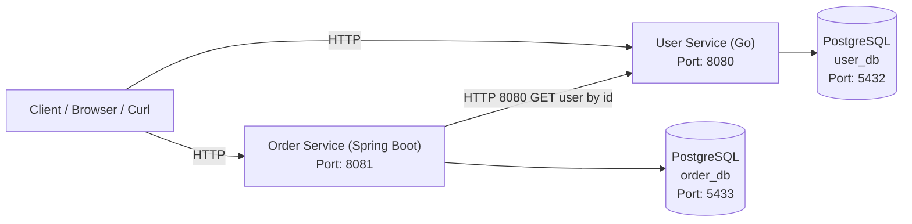

# Mini Ecommerce Microservices

## 1. Tổng quan (Overview)

**Mini Ecommerce Microservices** là một dự án microservices đơn giản nhằm mục đích **học tập và thực hành kiến trúc Microservices cũng như CI/CD pipeline**.

Hệ thống được xây dựng theo hướng cloud-native, tách biệt từng service độc lập, dễ dàng mở rộng và tích hợp vào các nền tảng DevOps/Kubernetes sau này.

Các service chính bao gồm:
- **User Service**
- **Order Service** (sẽ phát triển)
- **API Gateway** (sẽ phát triển)

---

## 2. Kiến trúc Microservices

Kiến trúc hệ thống tuân theo nguyên tắc:
- Mỗi microservice **độc lập về codebase và database**
- Các service **giao tiếp với nhau thông qua HTTP/REST**
- Database **không được chia sẻ giữa các service**



### 2.1 Bảng tổng hợp API (API Summary)

#### 🔹 User Service (Port: **8080**)

| Method | Endpoint | Mô tả |
|------|--------|------|
| GET | `/health` | Health check service |
| POST | `/users` | Tạo user mới |
| GET | `/users` | Lấy danh sách user |
| GET | `/users/{id}` | Lấy user theo ID |

**Ví dụ gọi API:**
```bash
curl http://localhost:8080/users
```

---

#### 🔹 Order Service (Port: **8081**)

| Method | Endpoint | Mô tả |
|------|--------|------|
| POST | `/orders` | Tạo đơn hàng (validate user qua User Service) |

**Query parameters:**

| Tên | Kiểu | Bắt buộc | Mô tả |
|---|---|---|---|
| `userId` | UUID | ✅ | ID của user |
| `totalAmount` | Double | ✅ | Tổng giá trị đơn hàng |

**Ví dụ gọi API:**
```bash
curl -X POST "http://localhost:8081/orders?userId=<USER_UUID>&totalAmount=120.5"
```

---

### 2.2 Thông tin port & service mapping

| Thành phần | Internal Port | Expose Port |
|----------|---------------|-------------|
| User Service | 8080 | 8080 |
| Order Service | 8080 | 8081 |
| user-db | 5432 | 5432 |
| order-db | 5432 | 5433 |


---

## 3. Chi tiết ứng dụng

### 3.1 User Service

**User Service** được viết hoàn toàn bằng **Go**, chịu trách nhiệm quản lý thông tin người dùng (CRUD User).

**Công nghệ sử dụng:**
- Go 1.22
- PostgreSQL
- Docker & Docker Compose
- RESTful API

---

### 🚀 Chạy User Service ở môi trường local

<details>
<summary><strong>Click để xem hướng dẫn chạy local User Service</strong></summary>

---

### Bước 1: Chạy PostgreSQL database

```bash
docker compose up -d user-db
```

Kiểm tra container đang chạy:

```bash
docker ps
```

---

### Bước 2: Tạo bảng USERS trong database (chỉ cần chạy 1 lần)

Exec vào container PostgreSQL:

```bash
docker exec -it user-db psql -U user -d user_db
```

Trong giao diện `psql`, tạo extension và bảng `users`:

```sql
CREATE EXTENSION IF NOT EXISTS "uuid-ossp";

CREATE TABLE IF NOT EXISTS users (
    id UUID PRIMARY KEY DEFAULT uuid_generate_v4(),
    name VARCHAR(100) NOT NULL,
    email VARCHAR(150) UNIQUE NOT NULL,
    created_at TIMESTAMP DEFAULT CURRENT_TIMESTAMP
);
```

Thoát khỏi `psql`:

```sql
\q
```

---

### Bước 3: Chạy User Service

```bash
docker compose up --build user-service
```

Nếu log hiển thị:

```
User Service running on :8080
```

👉 Điều này cho thấy **User Service đã kết nối thành công tới database**.

---

### Bước 4: Test nhanh API (mở terminal mới)

#### Health check

```bash
curl http://localhost:8080/health
```

---

#### Tạo user mới

```bash
curl -X POST http://localhost:8080/users \
  -H "Content-Type: application/json" \
  -d '{
    "name": "Tien Phat",
    "email": "tienphat@gmail.com"
  }'
```

---

#### Lấy danh sách user

```bash
curl http://localhost:8080/users
```

Ví dụ kết quả:

```json
[
  {
    "id": "f5caf3b2-832b-4470-917b-eebdf4b34e76",
    "name": "Tien Phat",
    "email": "tienphat@gmail.com",
    "created_at": "2026-01-16T03:13:05.152545Z"
  }
]
```

👉 Nếu các lệnh trên chạy thành công, **User Service đã hoạt động hoàn chỉnh ở môi trường local**.

</details>

---

### 3.2 Order Service

**Order Service** được viết bằng **Spring Boot + JPA**, chịu trách nhiệm quản lý đơn hàng và thực hiện **service-to-service communication** với User Service để xác thực người dùng trước khi tạo đơn.

Order Service **không truy cập trực tiếp database của User Service**, mà xác thực user thông qua HTTP call – đúng nguyên tắc microservices.

**Công nghệ sử dụng:**
- Java 17
- Spring Boot 3
- Spring Data JPA
- PostgreSQL
- Docker & Docker Compose
- RESTful API

---

### 🚀 Chạy Order Service ở môi trường local

<details>
<summary><strong>Click để xem hướng dẫn chạy local Order Service</strong></summary>

---

### Bước 1: Chạy toàn bộ hệ thống (User + Order)

Từ thư mục root của project:

```bash
docker compose up --build
```

Kiểm tra container:

```bash
docker ps
```

Kết quả mong đợi:

```
user-db
user-service
order-db
order-service
```

---

### Bước 2: Kiểm tra User Service (bắt buộc)

Order Service phụ thuộc vào User Service để xác thực user.

```bash
curl http://localhost:8080/users
```

Đảm bảo có ít nhất **1 user tồn tại**.

---

### Bước 3: Tạo order (user hợp lệ)

```bash
curl -X POST "http://localhost:8081/orders?userId=<USER_UUID>&totalAmount=120.5"
```

Ví dụ:

```bash
curl -X POST "http://localhost:8081/orders?userId=f5caf3b2-832b-4470-917b-eebdf4b34e76&totalAmount=120.5"
```

Kết quả ví dụ:

```json
{
  "id": "7cf2ff2e-b742-49a6-8214-67762d67b8bc",
  "userId": "f5caf3b2-832b-4470-917b-eebdf4b34e76",
  "totalAmount": 120.5,
  "status": "CREATED",
  "createdAt": "2026-01-16T03:44:42.36490Z"
}
```

---

### Bước 4: Tạo order với user không tồn tại

```bash
curl -X POST "http://localhost:8081/orders?userId=00000000-0000-0000-0000-000000000000&totalAmount=50"
```

Kết quả:

```
HTTP/1.1 400 Bad Request
User not found
```

👉 Điều này chứng minh:
- Order Service đã **gọi User Service thành công**
- Business validation hoạt động đúng
- Error handling được xử lý đúng chuẩn API

---

### 🔑 Nguyên tắc thiết kế

- **Database per service**
  - User Service → `user_db`
  - Order Service → `order_db`
- Không sử dụng foreign key giữa các service
- Service-to-service giao tiếp qua HTTP
- Order Service chỉ lưu `userId`, không lưu thông tin user

</details>
