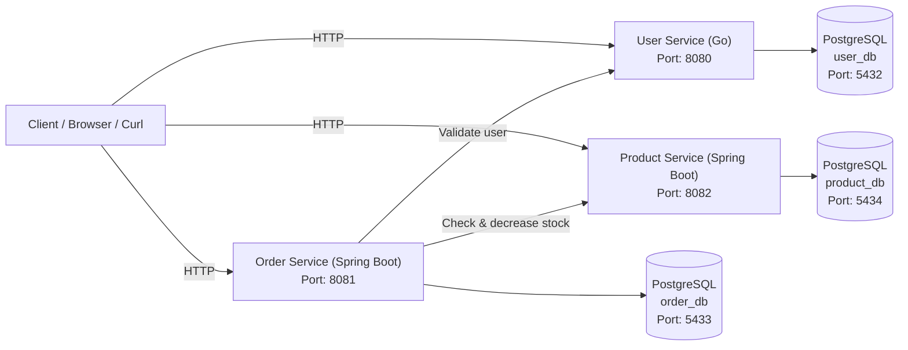

# Mini Ecommerce Microservices

## 1. Tổng quan (Overview)

**Mini Ecommerce Microservices** là một dự án microservices đơn giản nhằm mục đích **học tập và thực hành kiến trúc Microservices cũng như CI/CD pipeline**.

Hệ thống được xây dựng theo hướng cloud-native, tách biệt từng service độc lập, dễ dàng mở rộng và tích hợp vào các nền tảng DevOps/Kubernetes sau này.

Các service chính bao gồm:
- **User Service**
- **Order Service** (sẽ phát triển)
- **API Gateway** (sẽ phát triển)

---

## 2. Kiến trúc Microservices

Kiến trúc hệ thống tuân theo nguyên tắc:
- Mỗi microservice **độc lập về codebase và database**
- Các service **giao tiếp với nhau thông qua HTTP/REST**
- Database **không được chia sẻ giữa các service**



### 2.1 Bảng tổng hợp API (API Summary)

#### 🔹 User Service (Port: **8080**)

| Method | Endpoint | Mô tả |
|------|--------|------|
| GET | `/health` | Health check service |
| POST | `/users` | Tạo user mới |
| GET | `/users` | Lấy danh sách user |
| GET | `/users/{id}` | Lấy user theo ID |
| GET | `/users/{id}/role` | Lấy role của user (internal API cho service khác) |


**Ví dụ gọi API:**
```bash
curl http://localhost:8080/users
```

---

#### 🔹 Order Service (Port: **8081**)

| Method | Endpoint | Mô tả |
|------|--------|------|
| POST | `/orders` | Tạo đơn hàng (validate user qua User Service) |

**Query parameters:**

| Tên | Kiểu | Bắt buộc | Mô tả |
|---|---|---|---|
| `userId` | UUID | ✅ | ID của user |
| `productId` | UUID | ✅ | ID của product |
| `quantity` | Integer | ✅ | Số lượng mua |
| `totalAmount` | Double | ✅ | Tổng giá trị đơn hàng |

**Error cases:**
- `User not found`
- `Not enough stock`

**Ví dụ gọi API:**
```bash
curl -X POST "http://localhost:8081/orders?userId=<USER_UUID>&totalAmount=120.5"
```

---

#### 🔹 Product Service (Port: **8082**)

| Method | Endpoint | Mô tả |
|------|--------|------|
| POST | `/products` | Tạo sản phẩm |
| GET | `/products` | Lấy danh sách sản phẩm |
| GET | `/products/{id}` | Lấy sản phẩm theo ID |
| POST | `/products/{id}/decrease-stock?quantity={n}` | Giảm tồn kho sản phẩm |

---

### 2.2 Thông tin port & service mapping

| Thành phần | Internal Port | Expose Port |
|----------|---------------|-------------|
| User Service | 8080 | 8080 |
| Order Service | 8080 | 8081 |
| Product Service | 8080 | 8082 |
| user-db | 5432 | 5432 |
| order-db | 5432 | 5433 |
| product-db | 5432 | 5434 |

---

### 2.3 HTTP Status Codes

| Status | Ý nghĩa |
|------|--------|
| 201 | Tạo resource thành công |
| 400 | Input không hợp lệ |
| 403 | Không đủ quyền |
| 404 | Resource không tồn tại |
| 502 | Service phụ thuộc không khả dụng |

## 3. Chi tiết ứng dụng

### 3.1 User Service

**User Service** được viết hoàn toàn bằng **Go**, chịu trách nhiệm quản lý thông tin người dùng (CRUD User).

**Công nghệ sử dụng:**
- Go 1.22
- PostgreSQL
- Docker & Docker Compose
- RESTful API

---

### 🔐 User Role & Authorization

User Service chịu trách nhiệm **quản lý role người dùng** trong toàn hệ thống, phục vụ cho các service khác (Product / Order) kiểm tra quyền hạn.

#### Các role hiện tại

| Role | Mô tả |
|------|------|
| CUSTOMER | Người mua hàng |
| SELLER | Người bán, được phép tạo sản phẩm |

Role được lưu trực tiếp trong bảng `users` của User Service.

---

### 🚀 Chạy User Service ở môi trường local

<details>
<summary><strong>Click để xem hướng dẫn chạy local User Service</strong></summary>

---

### Bước 1: Chạy PostgreSQL database

```bash
docker compose up -d user-db
```

Kiểm tra container đang chạy:

```bash
docker ps
```

---

### Bước 2: Tạo bảng USERS trong database (chỉ cần chạy 1 lần)

Exec vào container PostgreSQL:

```bash
docker exec -it user-db psql -U user -d user_db
```

Trong giao diện `psql`, tạo extension và bảng `users`:

```sql
CREATE EXTENSION IF NOT EXISTS "uuid-ossp";

CREATE TABLE IF NOT EXISTS users (
    id UUID PRIMARY KEY DEFAULT uuid_generate_v4(),
    name VARCHAR(100) NOT NULL,
    email VARCHAR(150) UNIQUE NOT NULL,
    created_at TIMESTAMP DEFAULT CURRENT_TIMESTAMP
);
```

Thoát khỏi `psql`:

```sql
\q
```

---

### Bước 3: Chạy User Service

```bash
docker compose up --build user-service
```

Nếu log hiển thị:

```
User Service running on :8080
```

👉 Điều này cho thấy **User Service đã kết nối thành công tới database**.

---

### Bước 4: Test nhanh API (mở terminal mới)

#### Health check

```bash
curl http://localhost:8080/health
```

---

#### Tạo user mới (CUSTOMER)

```bash
curl -X POST http://localhost:8080/users \
  -H "Content-Type: application/json" \
  -d '{
    "name": "Tien Phat",
    "email": "tienphat@gmail.com",
    "role": "CUSTOMER"
  }'

```
#### Tạo user mới (SELLER)

```bash
curl -X POST http://localhost:8080/users \
  -H "Content-Type: application/json" \
  -d '{
    "name": "Seller One",
    "email": "seller1@gmail.com",
    "role": "SELLER"
  }'

```
---

#### Lấy danh sách user

```bash
curl http://localhost:8080/users
```

Ví dụ kết quả:

```json
[
  {
    "id": "edf3ed8d-bfc6-485b-bae3-db00d7fb73c1",
    "name": "Tien Phat",
    "email": "tienphat@gmail.com",
    "role": "CUSTOMER",
    "created_at": "2026-01-17T03:21:16.576701Z"
  },
  {
    "id": "62ca9e4e-8c65-4c7e-8348-535ff5e27b76",
    "name": "Seller One",
    "email": "seller1@gmail.com",
    "role": "SELLER",
    "created_at": "2026-01-17T04:45:35.827152Z"
  }
]

```

#### Lấy user theo ID

```bash
curl http://localhost:8080/users/{userId}
```

#### Lấy role user (Internal API – Service to Service)

API này chỉ dùng cho các service nội bộ như Product Service hoặc Order Service.

```bash
curl http://localhost:8080/users/{userId}/role
```

Ví dụ kết quả:

```json
{
  "id": "62ca9e4e-8c65-4c7e-8348-535ff5e27b76",
  "role": "SELLER"
}
```

👉 Nếu các lệnh trên chạy thành công, **User Service đã hoạt động hoàn chỉnh ở môi trường local**.

</details>

---

### 3.2 Order Service

**Order Service** được viết bằng **Spring Boot + JPA**, chịu trách nhiệm quản lý đơn hàng và thực hiện **service-to-service communication** với User Service để xác thực người dùng trước khi tạo đơn.

Order Service **không truy cập trực tiếp database của User Service**, mà xác thực user thông qua HTTP call – đúng nguyên tắc microservices.

**Công nghệ sử dụng:**
- Java 17
- Spring Boot 3
- Spring Data JPA
- PostgreSQL
- Docker & Docker Compose
- RESTful API

---

### 🚀 Chạy Order Service ở môi trường local

<details>
<summary><strong>Click để xem hướng dẫn chạy local Order Service</strong></summary>

---

### Bước 1: Chạy toàn bộ hệ thống (User + Order)

Từ thư mục root của project:

```bash
docker compose up --build
```

Kiểm tra container:

```bash
docker ps
```

Kết quả mong đợi:

```
user-db
user-service
order-db
order-service
```

---

### Bước 2: Kiểm tra User Service (bắt buộc)

Order Service phụ thuộc vào User Service để xác thực user.

```bash
curl http://localhost:8080/users
```

Đảm bảo có ít nhất **1 user tồn tại**.

---

### Bước 3: Tạo order 

##### Tạo order với user hợp lệ

```bash
curl -X POST "http://localhost:8081/orders?userId=<USER_UUID>&totalAmount=120.5"
```

Ví dụ:

```bash
curl -X POST "http://localhost:8081/orders?userId=f5caf3b2-832b-4470-917b-eebdf4b34e76&totalAmount=120.5"
```

Kết quả ví dụ:

```json
{
  "id": "7cf2ff2e-b742-49a6-8214-67762d67b8bc",
  "userId": "f5caf3b2-832b-4470-917b-eebdf4b34e76",
  "totalAmount": 120.5,
  "status": "CREATED",
  "createdAt": "2026-01-16T03:44:42.36490Z"
}
```

---

#### Tạo order với user không tồn tại

```bash
curl -X POST "http://localhost:8081/orders?userId=00000000-0000-0000-0000-000000000000&totalAmount=50"
```

Kết quả:

```
HTTP/1.1 400 Bad Request
User not found
```

#### Tạo order với số lượng vượt quá tồn kho

```bash
curl -X POST "http://localhost:8081/orders?userId=<USER_ID>&productId=<PRODUCT_ID>&quantity=9999&totalAmount=999999"
```

👉 Điều này chứng minh:
- Order Service đã **gọi User Service thành công**
- Business validation hoạt động đúng
- Error handling được xử lý đúng chuẩn API

---

### 🔑 Nguyên tắc thiết kế

- **Database per service**
  - User Service → `user_db`
  - Order Service → `order_db`
- Không sử dụng foreign key giữa các service
- Service-to-service giao tiếp qua HTTP
- Order Service chỉ lưu `userId`, không lưu thông tin user

</details>


### 3.3 Product Service

**Product Service** được viết bằng **Spring Boot + JPA**, chịu trách nhiệm quản lý thông tin sản phẩm.

**Công nghệ sử dụng:**
- Java 17
- Spring Boot 3
- Spring Data JPA
- PostgreSQL
- Docker & Docker Compose

### 🚀 Chạy Product Service ở môi trường local

<details>
<summary><strong>Click để xem hướng dẫn chạy local Product Service</strong></summary>

---

```bash
docker compose up --build product-service
```

#### Tạo product với SELLER (HỢP LỆ)

```bash
curl -X POST http://localhost:8082/products \
  -H "Content-Type: application/json" \
  -H "X-User-Id: 62ca9e4e-8c65-4c7e-8348-535ff5e27b76" \
  -d '{
    "name": "Macbook Pro",
    "price": 2500,
    "stock": 5
  }'
```

Ví dụ response:

```json
{
  "id": "e747500d-6719-4819-95a2-6016ee931865",
  "name": "Macbook Pro",
  "price": 2500.0,
  "stock": 5,
  "createdAt": "2026-01-17T05:08:12.580307703Z"
}
```

#### Tạo product với CUSTOMER (BỊ TỪ CHỐI)

```bash
curl -X POST http://localhost:8082/products \
  -H "Content-Type: application/json" \
  -H "X-User-Id: edf3ed8d-bfc6-485b-bae3-db00d7fb73c1" \
  -d '{
    "name": "iPhone 15",
    "price": 1200,
    "stock": 10
  }'
```

Response:
```json
Only SELLER can create product
```

#### Lấy danh sách product

```bash
curl http://localhost:8082/products
```

#### Lấy product theo ID

```bash
curl http://localhost:8082/products/{productId}
```

#### Giảm tồn kho sản phẩm

```bash
curl -X POST "http://localhost:8082/products/{productId}/decrease-stock?quantity=2"
```

</details>

### 3.4 ORDER ↔ PRODUCT INTEGRATION
#### 📦 Order tạo đơn & tự động trừ tồn kho sản phẩm

Khi tạo đơn hàng thành công, Order Service sẽ gọi sang Product Service để:
- Kiểm tra tồn kho
- Giảm số lượng sản phẩm tương ứng

**Luồng xử lý:**
```bash
Client
  → Order Service
      → Validate User (User Service)
      → Check & Decrease Stock (Product Service)
      → Save Order
```

**Tạo order hợp lệ (Customer mua hàng)**
Điều kiện:
- User tồn tại
- Product tồn tại
- Quantity ≤ stock hiện tại

```bash 
curl -X POST "http://localhost:8081/orders?userId=edf3ed8d-bfc6-485b-bae3-db00d7fb73c1&productId={productID}&quantity=2&totalAmount=5000"
```
**Ví dụ response:**
```json
{
  "id": "3039ef0d-2c04-4bf4-a47b-40c149e16033",
  "userId": "edf3ed8d-bfc6-485b-bae3-db00d7fb73c1",
  "productId": "e747500d-6719-4819-95a2-6016ee931865",
  "quantity": 2,
  "totalAmount": 5000.0,
  "status": "CREATED",
  "createdAt": "2026-01-17T05:24:39.948603194Z"
}

```

**🔍 Kiểm tra tồn kho sau khi tạo order**

Sau khi order được tạo thành công, tồn kho của sản phẩm sẽ giảm tương ứng.

```bash
curl http://localhost:8082/products/{productID}
```
**Ví dụ kết quả:**

```json
{
  "id": "e747500d-6719-4819-95a2-6016ee931865",
  "name": "Macbook Pro",
  "price": 2500.0,
  "stock": 3,
  "createdAt": "2026-01-17T05:08:12.580308Z"
}
```

#### Các trường hợp lỗi

**Quantity vượt quá tồn kho**
```bash
curl -X POST "http://localhost:8081/orders?userId=<USER_ID>&productId=<PRODUCT_ID>&quantity=9999&totalAmount=999999"
```

**Response:**

```matheamtica
400 Bad Request
Not enough stock
```

**Product không tồn tại**

```bash
curl -X POST "http://localhost:8081/orders?userId=<USER_ID>&productId=00000000-0000-0000-0000-000000000000&quantity=1&totalAmount=100"
```

**Response:**

```matheamtica
400 Bad Request
Product not found
```