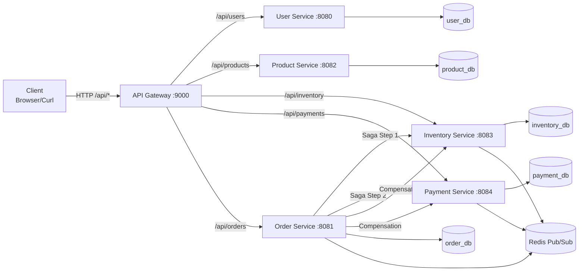

# Mini Ecommerce Microservices

## 1. Overview

**Mini Ecommerce Microservices** is a polyglot distributed system for microservices and DevOps/AIOps practice.

Current runtime topology:

- `api-gateway` (Spring Cloud Gateway)
- `user-service` (Go)
- `product-service` (Spring Boot)
- `inventory-service` (Go)
- `payment-service` (Spring Boot)
- `order-service` (Spring Boot, Saga orchestrator)
- `front-end` (React)
- `redis` (async event backbone)
- `postgres` per service database
- `tempo`, `prometheus`, `grafana`, `loki`, `promtail`

Default local ports:

- API Gateway: `9000`
- Front-end: `5173`
- User/Product/Order/Inventory/Payment services: internal network only (not published to host in compose)
- Redis/Postgres: internal network only (not published to host in compose)
- Grafana: `3000`
- Prometheus: `9090`
- Loki: `3100`
- Tempo: `3200` (UI API), `4317/4318` (OTLP)

## 2. Architecture



## 3. Saga Workflow (Order Service)

Order creation uses orchestrated Saga steps:

1. Create order with `CREATED`
2. Reserve inventory (`inventory-service`)
3. Process payment (`payment-service`)
4. Mark order `CONFIRMED` if all steps pass
5. If any step fails, run compensation:
   - release inventory if already reserved
   - refund payment if already paid
   - mark order `FAILED`

Order statuses used in service logic:

- `CREATED`
- `INVENTORY_RESERVED`
- `PAYMENT_PENDING`
- `CONFIRMED`
- `FAILED`
- `CANCELLED`

Saga step history is persisted and can be queried via:

- `GET /api/orders/{id}/saga`

## 4. API Surface (via Gateway)

Base URL:

```text
http://localhost:9000
```

### 4.1 User Service (`/api/users`)

| Method | Endpoint | Auth | Description |
|---|---|---|---|
| GET | `/api/users/health` | Public | Health check |
| POST | `/api/users` | Public | Register user (`CUSTOMER/SELLER`) |
| POST | `/api/users/login` | Public | Login and get JWT |
| GET | `/api/users` | Bearer JWT (`ADMIN`) | List active users |
| GET | `/api/users/{id}` | Bearer JWT (Owner or `ADMIN`) | Get user by ID |
| GET | `/api/users/by-email?email=...` | Bearer JWT (`ADMIN`) | Get user by email |
| GET | `/api/users/email-exists?email=...` | Bearer JWT (`ADMIN`) | Check email existence |
| PUT | `/api/users/{id}` | Bearer JWT (Owner or `ADMIN`) | Update user |
| PATCH | `/api/users/{id}/activate` | Bearer JWT (`ADMIN`) | Activate user |
| PATCH | `/api/users/{id}/deactivate` | Bearer JWT (`ADMIN`) | Deactivate user |
| DELETE | `/api/users/{id}` | Bearer JWT (Owner or `ADMIN`) | Soft-delete user |
| GET | `/api/users/stats` | Bearer JWT (`ADMIN`) | User statistics |

### 4.2 Product Service (`/api/products`)

| Method | Endpoint | Auth | Description |
|---|---|---|---|
| GET | `/api/products` | Public | List products |
| GET | `/api/products/{id}` | Public | Get product detail |
| POST | `/api/products` | Bearer JWT (`SELLER/ADMIN`) | Create product |
| POST | `/api/products/{id}/decrease-stock?quantity=n` | Internal | Decrease stock |
| POST | `/api/products/{id}/increase-stock?quantity=n` | Internal | Increase stock |

### 4.3 Inventory Service (`/api/inventory`)

| Method | Endpoint | Auth | Description |
|---|---|---|---|
| GET | `/api/inventory/health` | Public | Health check |
| GET | `/api/inventory/{productId}` | Bearer JWT | Check available stock |
| POST | `/api/inventory/reserve` | Bearer JWT (`ADMIN`) | Reserve stock (supports idempotency key) |
| POST | `/api/inventory/release` | Bearer JWT (`ADMIN`) | Release reserved stock (compensation) |
| GET | `/api/inventory/simulate-cpu` | Bearer JWT (`ADMIN`) | CPU load simulation |
| GET | `/api/inventory/simulate-memory` | Bearer JWT (`ADMIN`) | Memory load simulation |

### 4.4 Payment Service (`/api/payments`)

| Method | Endpoint | Auth | Description |
|---|---|---|---|
| GET | `/api/payments/health` | Public | Health check |
| POST | `/api/payments/pay` | Bearer JWT (`ADMIN`) | Process payment (supports idempotency key) |
| POST | `/api/payments/refund` | Bearer JWT (`ADMIN`) | Refund payment (compensation) |
| GET | `/api/payments/order/{orderId}` | Bearer JWT (`ADMIN`) | Payment timeline by order |
| GET | `/api/payments/simulate-cpu` | Bearer JWT (`ADMIN`) | CPU load simulation |
| GET | `/api/payments/simulate-memory` | Bearer JWT (`ADMIN`) | Memory load simulation |

### 4.5 Order Service (`/api/orders`)

| Method | Endpoint | Auth | Description |
|---|---|---|---|
| POST | `/api/orders` | Bearer JWT (`CUSTOMER/ADMIN`) | Create order via Saga (requires `Idempotency-Key`) |
| GET | `/api/orders` | Bearer JWT (`CUSTOMER/ADMIN`) | List current user orders |
| GET | `/api/orders?userId=<uuid>` | Bearer JWT (`ADMIN`) | Query orders by user |
| GET | `/api/orders/{id}/saga` | Bearer JWT (`CUSTOMER/ADMIN`) | List saga steps for an order |
| PATCH | `/api/orders/{id}/cancel` | Bearer JWT (`CUSTOMER/ADMIN`) | Cancel order + compensation |
| GET | `/api/orders/outbox/pending?limit=20` | Bearer JWT (`ADMIN`) | Pending outbox events |

## 5. Environment Variables

Copy template:

```bash
cp .env.example .env
```

Minimal required values in `.env`:

```env
AUTH_JWT_SECRET=<long-random-secret>
USER_DB_PASSWORD=<password>
PRODUCT_DB_PASSWORD=<password>
ORDER_DB_PASSWORD=<password>
INVENTORY_DB_PASSWORD=<password>
PAYMENT_DB_PASSWORD=<password>
GRAFANA_ADMIN_USER=<username>
GRAFANA_ADMIN_PASSWORD=<strong-password>
```

Optional tuning (already in `.env.example`):

- Payment behavior:
  - `PAYMENT_FAILURE_PROBABILITY`
  - `PAYMENT_DELAY_MS`
- Saga retry/circuit breaker:
  - `HTTP_CONNECT_TIMEOUT_MS`
  - `HTTP_READ_TIMEOUT_MS`
  - `SAGA_RETRY_MAX_ATTEMPTS`
  - `SAGA_RETRY_INITIAL_BACKOFF_MS`
  - `SAGA_CB_FAILURE_THRESHOLD`
  - `SAGA_CB_OPEN_DURATION_MS`
- Chaos mode:
  - `CHAOS_MODE`
  - `LATENCY_PROBABILITY`
  - `ERROR_PROBABILITY`
  - `CHAOS_DELAY_MS`

## 6. Run Locally with Docker Compose

Start full stack:

```bash
docker compose up --build -d
```

Start only observability:

```bash
docker compose up -d tempo prometheus grafana loki promtail
```

Check status:

```bash
docker compose ps
```

Stop stack:

```bash
docker compose down
```

Stop and remove volumes:

```bash
docker compose down -v
```

## 7. API Testing

Service-level smoke scripts:

```bash
./api-testing/user-service.sh
./api-testing/product-service.sh
./api-testing/inventory-service.sh
./api-testing/payment-service.sh
./api-testing/order-service.sh
```

Run full API suite:

```bash
./api-testing/full-test.sh
```

If needed, override gateway URL:

```bash
BASE_URL=http://localhost:9000 ./api-testing/full-test.sh
```

## 8. Independent Microservice Development

Start minimal stack for one service:

```bash
./scripts/dev-stack.sh up user
./scripts/dev-stack.sh up product
./scripts/dev-stack.sh up inventory
./scripts/dev-stack.sh up payment
./scripts/dev-stack.sh up order
```

Inspect minimal file scope for one service:

```bash
./scripts/service-context.sh order
```

Detailed guide:

- `docs/microservice-independent-dev.md`

## 9. CI/CD Pipeline (Jenkinsfile)

The Jenkins pipeline is dynamic and matrix-driven:

- Service matrix includes:
  - `api-gateway`
  - `user-service`
  - `product-service`
  - `inventory-service`
  - `payment-service`
  - `order-service`
  - `frontend` (directory `front-end`)
- Detects changed services using `git diff`.
- Rebuilds all services when `Jenkinsfile` changes.
- Runs stages in parallel for selected services:
  - test
  - build image
  - trivy scan
  - push image
  - update image tags in GitOps repo (`kubernetes-hub`)
- Cleans up built images on Jenkins worker after successful run.

## 10. Observability

The stack ships with:

- Traces: Tempo (OTLP)
- Metrics: Prometheus
- Logs: Loki + Promtail
- Dashboards: Grafana (pre-provisioned datasources/dashboards)

Useful URLs:

- Grafana: `http://localhost:3000` (use `GRAFANA_ADMIN_USER` / `GRAFANA_ADMIN_PASSWORD`)
- Prometheus: `http://localhost:9090`
- Tempo API: `http://localhost:3200`

## 11. Notes

- API contracts are under `api-contracts/`.
- Front-end communicates only through `api-gateway`.
- For local browser use, CORS is configured in gateway for `http://localhost:5173`.
